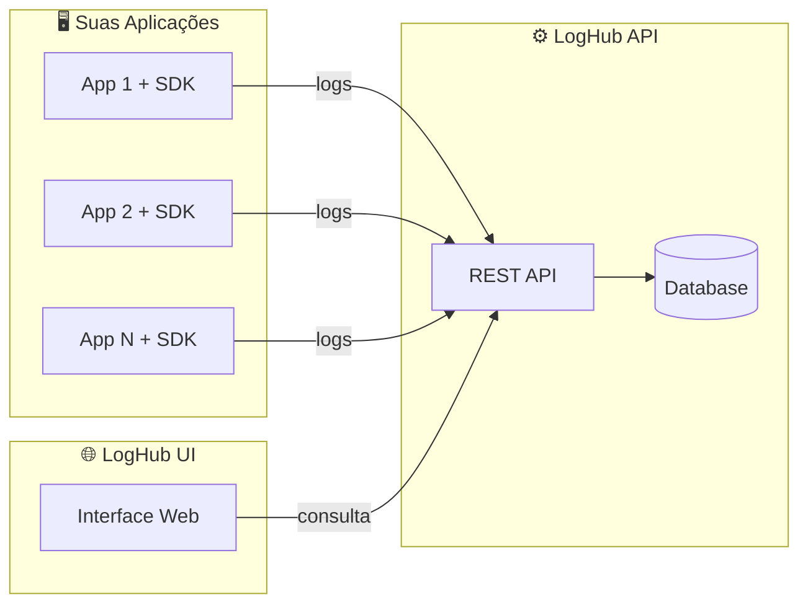

<div align="center">

# 🌐 LogHub UI

**Interface web para visualização e diagnóstico de logs**

[](https://react.dev/)
[](https://www.typescriptlang.org/)
[](https://vite.dev/)
[](https://tailwindcss.com/)
[](LICENSE)
[](https://github.com/LogHub-Open/.github/blob/main/CONTRIBUTING.md)

[Sobre](#-sobre) •
[Instalação](#-instalação) •
[Configuração](#️-configuração) •
[Contribuindo](#-contribuindo) •
[Licença](#-licença)

</div>

---

## 📋 Sumário

- [Sobre](#-sobre)
- [Funcionalidades](#-funcionalidades)
- [Stack Tecnológica](#️-stack-tecnológica)
- [Instalação](#-instalação)
- [Configuração](#️-configuração)
- [Estrutura do Projeto](#-estrutura-do-projeto)
- [Integração com a API](#-integração-com-a-api)
- [Indicadores de Nível](#-indicadores-de-nível)
- [Ecossistema LogHub](#-ecossistema-loghub)
- [Contribuindo](#-contribuindo)
- [Licença](#-licença)

## ✨ Sobre

O **LogHub UI** é a interface web do ecossistema LogHub: oferece visualização, busca e diagnóstico de logs para desenvolvedores e equipes de operações, consumindo os dados persistidos pela [LogHub API](https://github.com/LogHub-Open/loghub-api).

## 🌟 Funcionalidades

- 📋 **Visualização de Logs** — tabela interativa com Timestamp, Level, Application, Environment e Message
- 🔍 **Filtros Avançados** — por aplicação, ambiente, nível e período
- 📄 **Detalhes Completos** — modal com TraceId e Metadata
- 🎨 **Indicadores Visuais** — cores por nível de log para identificação rápida
- ⚡ **Performance** — construído com Vite para dev e build ultrarrápidos
- 📱 **Responsivo** — interface adaptável para diferentes tamanhos de tela

## 🛠️ Stack Tecnológica

| Tecnologia | Versão | Descrição |
|------------|--------|-----------|
| [React](https://react.dev/) | 19 | Biblioteca para construção de interfaces |
| [TypeScript](https://www.typescriptlang.org/) | 5.9 | Superset tipado de JavaScript |
| [Vite](https://vite.dev/) | 7.2 | Build tool e dev server |
| [Tailwind CSS](https://tailwindcss.com/) | 4.1 | Framework CSS utilitário |
| [Axios](https://axios-http.com/) | 1.13 | Cliente HTTP |

## 📦 Instalação

### Pré-requisitos

- [Node.js](https://nodejs.org/) 20.19+ ou 22.12+
- npm, yarn ou pnpm

### Passos

```bash
git clone https://github.com/LogHub-Open/loghub-ui.git
cd loghub-ui
npm install
npm run dev
```

O aplicativo estará disponível em `http://localhost:5173`.

## ⚙️ Configuração

### Variáveis de Ambiente

```bash
cp .env.example .env
```

| Variável | Descrição | Exemplo |
|----------|-----------|---------|
| `VITE_LOGHUB_API_URL` | URL base da API do LogHub | `http://localhost:8080/api` |
| `VITE_LOGHUB_API_KEY` | Chave de autenticação da API | `sua-api-key-aqui` |

### Scripts Disponíveis

```bash
npm run dev      # Inicia o servidor de desenvolvimento
npm run build    # Gera build de produção
npm run preview  # Visualiza o build de produção
npm run lint     # Executa o linter
```

## 📁 Estrutura do Projeto

```
src/
├── api/
│   └── loghubApi.ts      # Cliente Axios centralizado
├── components/
│   ├── LogTable.tsx      # Tabela de logs
│   ├── LogFilters.tsx    # Filtros de busca
│   └── LogDetails.tsx    # Modal de detalhes
├── pages/
│   └── LogsPage.tsx      # Página principal
├── types/
│   └── LogEvent.ts       # Tipos TypeScript
├── App.tsx               # Componente raiz
├── main.tsx              # Ponto de entrada
└── index.css             # Estilos globais
```

## 🔌 Integração com a API

### Endpoints Utilizados

| Método | Endpoint | Descrição |
|--------|----------|-----------|
| `GET` | `/logs` | Lista logs com filtros |
| `GET` | `/logs/:id` | Detalhes de um log específico |

### Parâmetros de Filtro

| Parâmetro | Tipo | Descrição |
|-----------|------|-----------|
| `application` | string | Nome da aplicação |
| `environment` | string | Ambiente (production, staging, etc.) |
| `level` | string | Nível do log (TRACE, DEBUG, INFO, WARN, ERROR) |
| `from` | string | Data/hora inicial (ISO 8601) |
| `to` | string | Data/hora final (ISO 8601) |

## 🎨 Indicadores de Nível

| Level | Cor | Uso |
|-------|-----|-----|
| `TRACE` | Cinza | Informações detalhadas de debug |
| `DEBUG` | Cinza escuro | Informações de desenvolvimento |
| `INFO` | Azul | Eventos informativos |
| `WARN` | Amarelo | Situações de alerta |
| `ERROR` | Vermelho | Erros e exceções |

## 🌐 Ecossistema LogHub

O LogHub UI faz parte de um ecossistema completo para gerenciamento de logs:

| Projeto | Descrição | Link |
|---------|-----------|------|
| **LogHub API** | Backend RESTful para coleta, armazenamento e consulta de logs | [loghub-api](https://github.com/LogHub-Open/loghub-api) |
| **LogHub SDK** | SDK para integração das aplicações com o LogHub | [loghub-sdk](https://github.com/LogHub-Open/loghub-sdk) |
| **LogHub UI** | Interface web para visualização e diagnóstico de logs | Este repositório |



**Como funciona:** suas aplicações usam o **SDK** para enviar logs estruturados via HTTP para a **API**, que os armazena e indexa; você visualiza e analisa os dados através desta **UI**.

## 🤝 Contribuindo

Este projeto segue as diretrizes gerais da organização:

- 📖 [Guia de Contribuição](https://github.com/LogHub-Open/.github/blob/main/CONTRIBUTING.md) — como abrir fork, branch e Pull Request, e como reportar bugs ou sugerir melhorias
- 🤝 [Código de Conduta](https://github.com/LogHub-Open/.github/blob/main/CODE_OF_CONDUCT.md)
- 🔒 [Política de Segurança](https://github.com/LogHub-Open/.github/blob/main/SECURITY.md) — para reportar vulnerabilidades

Padrão rápido de commit ([Conventional Commits](https://www.conventionalcommits.org/pt-br/)):

```bash
git commit -m "feat: adiciona nova feature"
git commit -m "fix: corrige comportamento do filtro de nível"
```

## 📝 Licença

Este projeto está licenciado sob a [MIT License](LICENSE).

---

<div align="center">

⭐ Se este projeto te ajudou, considere dar uma estrela!

</div>
